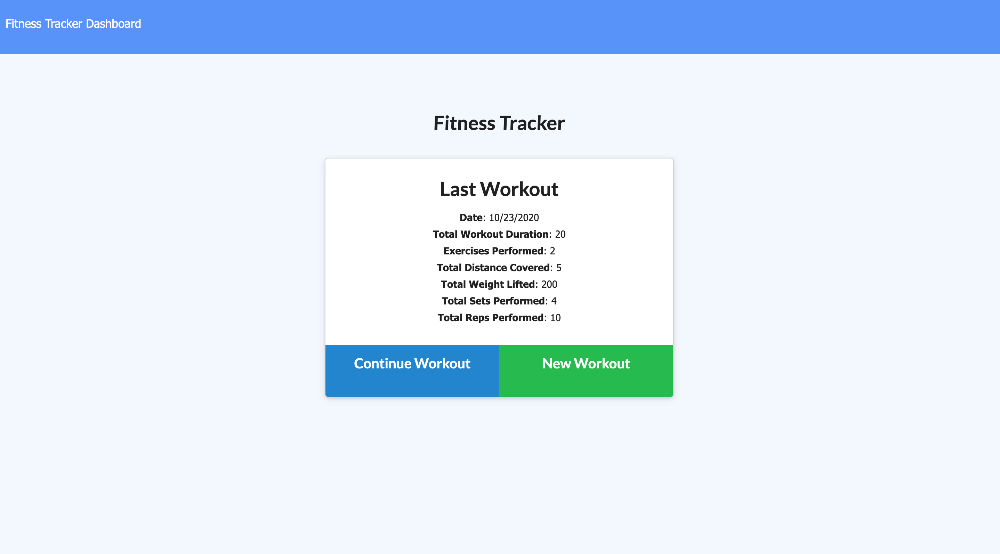

# fitness-witness
  

## Description
Fitness tracker that allows user to add exercises to a previous or new workout and view stats for multiple workouts.

## Table of Contents
- [Preview](#preview)
- [Installation](#installation)
- [Usage](#usage)
- [License](#license)
- [Contributing](#contributing)
- [Tests](#tests)
- [Questions](#questions)

## Preview  
[View full application on Heroku!](https://ls-fitness-witness.herokuapp.com/)  

## Installation
Use the package manager npm to install fitness-witness  
<pre><code>npm install fitness-witness</code></pre>

## Usage
If attempting to run locally, navigate to fitness-witness folder in command line and 'npm install' to install dependencies. To seed database, type 'npm run seed'.

## License  
Click on the badge (top of page) for this project's MIT licensing information.

## Contributing
Pull requests and stars are always welcome. For bugs and feature requests, [please submit an issue](https://github.com/ShepLT1/fitness-witness/issues/new)

## Tests  
To run tests, run the following command:
<pre><code>npm run test</pre></code>

## Questions
Please contact me with questions via email or Github  
 
lshepherd234@gmail.com  
[Github Profile](https://github.com/ShepLT1)